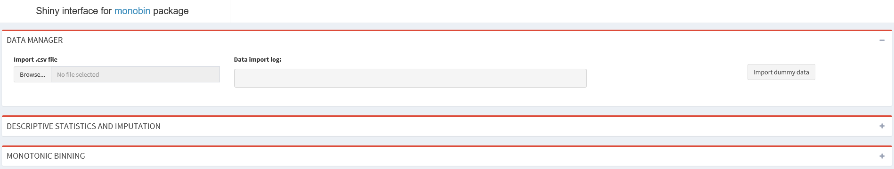
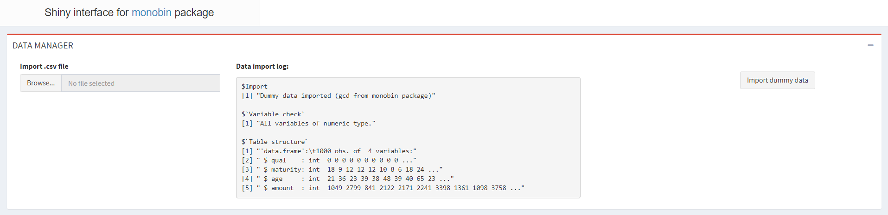
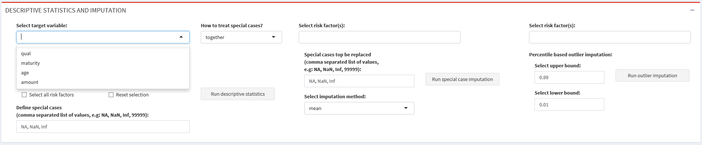
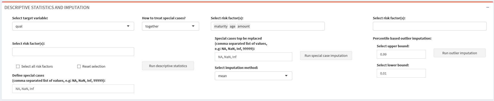
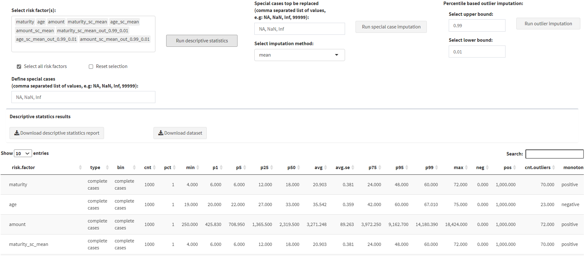
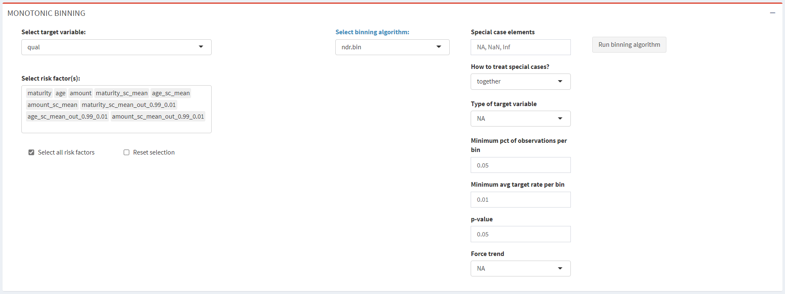
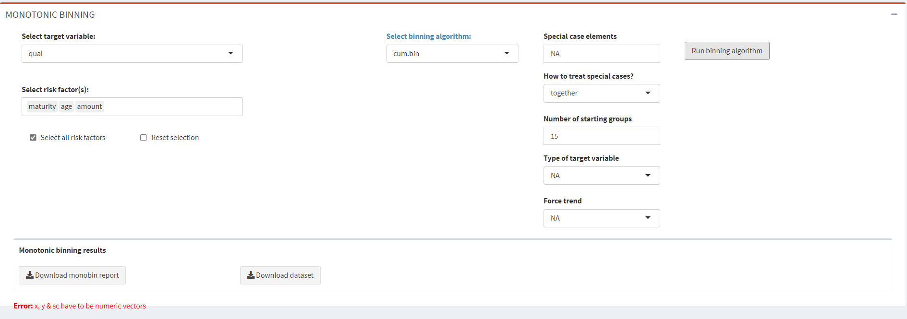
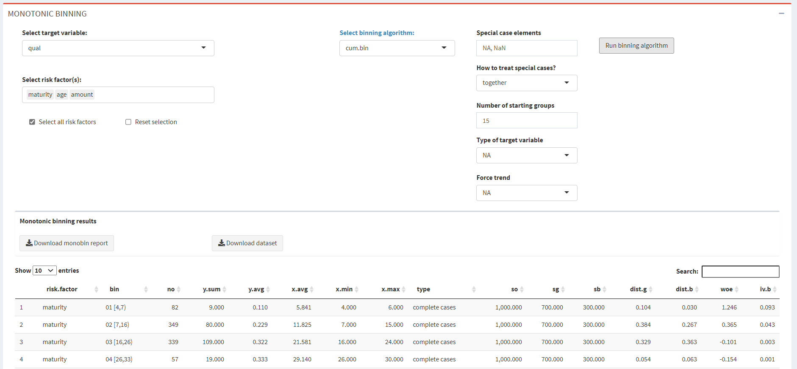
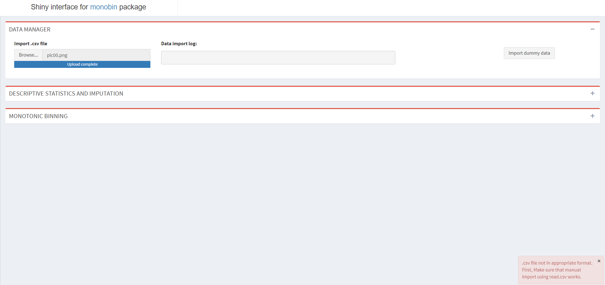

# monobinShiny
This is an add-on package to the ```monobin``` package that simplifies its use. The goal of monobin is to perform monotonic binning of numeric risk factor in credit 
rating models (PD, LGD, EAD) development. All functions handle both binary and continuous target variable. Missing values and other possible special values are treated 
separately from so-called complete cases.

```monobinSiny``` provides shiny-based user interface (UI) to monobin packaga and it can be especially handy for less experienced R users as well as for those who intend to 
perform quick scanning of numeric risk factors when building credit rating models. The additional functions implemented in ```monobinShiny``` that do no exist in ```monobin``` 
package are: descriptive statistics, special case and outliers imputation. The function descriptive statistics is exported and can be used in R sessions independently from the 
user interface, while special case and outlier imputation functions are written to be used with shiny UI.


## Installation

User can install the released version of monobinShiny from [CRAN](https://CRAN.R-project.org) executing the following line of the code:

``` r
install.packages("monobinShiny")
```

## How to start monobinShiny application?

After installation, to start shiny application, just type:

``` r
suppressMessages(library(monobinShiny))
monobinShinyApp()
```
If the application is installed and started properly, the following should appear in web browser:



Application consists of the three modules:
1. data manager
2. descriptive statistics and imputation
3. monotonic binning

Following sections provide short description of the each module.
> :information_source: Almost all reactive elements of the application results with a notification, so be aware of this as presented in the lower right corner.

## DATA MANAGER MODULE
This module serves for data import: manual import browsing for a file (only .csv files accepted) or automatic import of ```gcd``` from ```monobin``` package (Import dummy 
data).



During the manual data import, set of checks are performed such as: file extension, approprietness of .csv file and the number of identified numeric variables. 
If data are imported successfully, in Data Import log output, overview of the data structure will be presented along with information about identified numeric / categorical 
variables.


> :warning: Be aware that only variables identified as of numeric type will be processed for other two modules. 

## DESCRIPTIVE STATISTICS AND IMPUTATION
This module covers the standard steps of univariate and part of bivariate analysis in model development supplemented by the simple options for imputation of special case values 
and outlier imputation based on selected percentiles thresholds.

Before running any of the imputation procedures, target variable needs to be selected:



After selecting target variable, usually imputation procedures are run. 



> :warning: Be aware that imputation procedures will create and add new risk factor to imported data set. Special case values imputation will add the new risk factor names 
            as ```selected risk factor + _sc_ + selected imputation method ```. Example: if user select risk factor age and mean as imputation method, new risk factor will be 
            added as age_sc_mean.
            The same procedure will run for outlier imputation adding new risk factor as  ```selected risk factor + _out_ + selected upper percentile + _ +  selected lower 
            percentile``` (e.g. age_out_0.99_0.01).
            Special attention should be paid when data set contains more risk factors, becasue final number of risk factors can increase significantly using imputations.

> :information_source: In case that imputation values cannot be calculated, download buttons will appear providing possibility to the user to download and check for which risk 
                       factors inputs are not defined properly (all special case values and special case values to be imputed). Both fields all special case values and special 
                       case values to be imputed should be defined as a list of numeric values (or values that can coerce to numeric including NA) separated by comma (,).
             

Ultimate goal of this module is to create report of descriptive statistics. Image below presents example of descriptive report. Details on calculated metrics can be found in 
the help page of the function  ```desc.stat (?desc.stat)```.
As it can be seen, user has a possibility to download descriptive statistics report as well as data set used for its creation. If imputation procedures are run, data set will contain added risk factors (.csv files).

 

## MONOTONIC BINNING
Monotonic binning module reflects the main purpose of this package - interface to ```monobin``` package. Similar to the previous module, user should first select the target 
variable, then risk factors ready for binning (if imputation is performed, the list of available risk factors will contain newly created risk factors) and finally define 
arguments of selected binning algorithm. Available binning algorithms are those implemented in ```monobin``` package.



Running the binning procedure will result in summary table of processed risk factors and transformed data set. Both outputs can be downloaded as .csv files.


> :warning: **Recommendation is always to keep the defaulted special case elements, or if user considers only NA to supplement it with NaN (NA, NaN). This is due to the input 
            check in  ```monobin``` package that will return an error in case of defining only NA as a special case (!is.numeric(NA)). For current version of ```monobinShiny``` 
            this is solved adding NaN if only NA is defined as the special case element.
            With new release of ```monobin``` package this will be fixed.**
           
Example of error (only NA selected in special case elements):


Fix of previous error (NaN added to NA as special case elements - NA, NaNA):



## Data checks and notifications
As already stated, almost every reactive element of the application produce notification output (lower righ corner). Example of error notification for trying to import file other than .csv is
presented in the following image



Below is the list of data checks and notification implemented:

